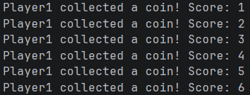
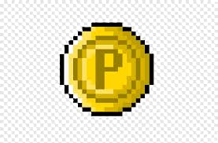
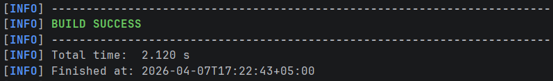
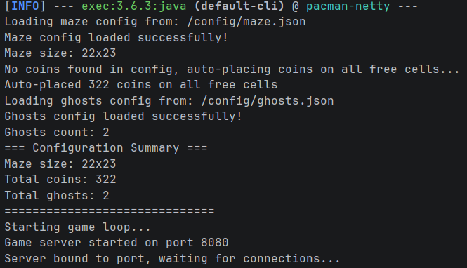
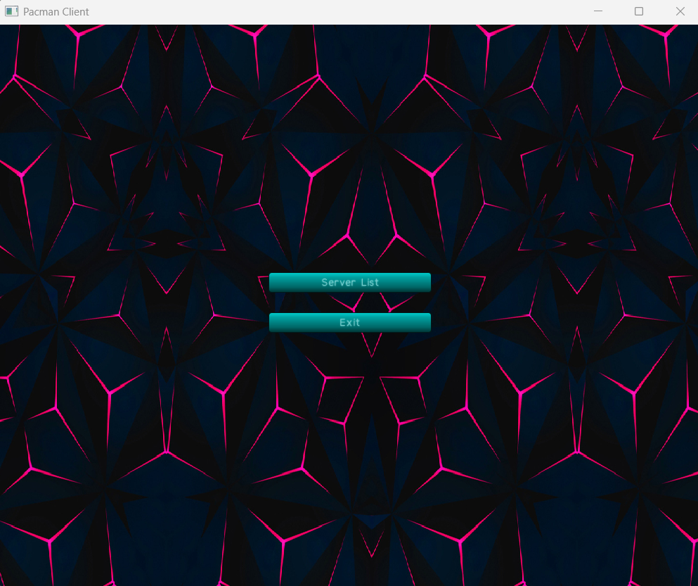
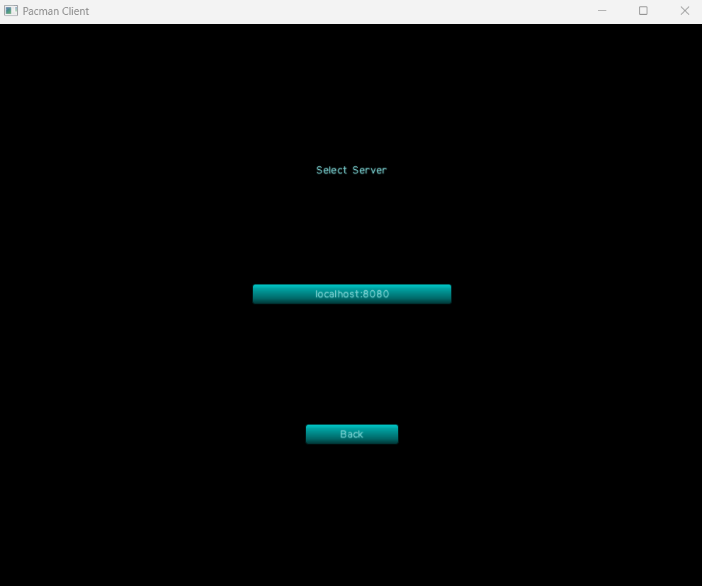

# PacmanGame
  
Проект реализует клиент-серверное приложение с помощью фреймворка Netty, библиотеки LibGDX на языке java для игры в pacman на сервере.  
---
## Описание  
Данный проект пока что не является масштабированным и работает исключительно на localhost с портом :8080, имеет ограничение на 4-х игроков, одну карту, двух призраков с примитивным ИИ.  

Примечание  
---
Для сборки проекта применялся apache-maven-3.9.14, а так же JDK версии 17.  
Прежде чем перейти к дальнейшим действиям, убедитесь, что у вас установлены необходимые компоненты.

### 1. Сервер (server)
- Для обмена данными используется проткол TCP
- Сервер реализует всю логику и ключевые механики взаимодействия пользователей с игровым миром
- Netty с ассинхронным ввод\вывод
- Сериализация с помощью Java Object Serialization
- Используется ConcurrentHashMap для потокобезопасности
- ScheduledExecutorService для игрового цикла
- Работает с ИИ для призраков (обычное\преследование игрока)
- Реализует обычное и диагональное движение, а так же (при зажатых противонаправленных клавишах) метод брождения от припятствия к перпятсивию
- Коллизия между игроками (игроки не могут проходить сквозь друг-друга)
- Столкновения с призраками отправляет модельку пакмана игрока на точку респауна (по умолчанию в левом нижнем углу карты)
- Система сбора монет и подсчета очков (вывод кол-ва очков выводится на сервере)  

  
### 2. Клиент (client)
Состоит из нескольких классов:  
- PacmanGame.java - это менеджер экранов для отображения меню списка серверов и самой игры
- MainMenuScreen.java - отображает главное меню на клиенте с фоном и парой кнопок
- ServerListScreen.java -  показывает доступные серверы для подключения
- GameClient.java - класс который занимается взаимодействием с сервером и отрисовкой игрового мира и анимаций
- GameClientLauncher - является точкой запуска клиента. В нем задаются параметры разрешения для окна

### 3. Общие классы (common)
- Coin.java - Представляет монету на игровом поле, которую игрок собирает для получения очков.  

- Direction.java - обозначает состояние игрока (стоит или движется в каком-то направлении)
- CommandType.java - позволяет серверу понимать, какие команды передает клиент ему
- Command.java - передает серверу все необходимые параметры для команд
- GameState.java - передает состояние игрового мира всем игрокам для синхронизации, выполняя сериализацию
- Ghost.java - управляет поведением призраков, включая поле зрения, память о позиции игрока и преследование.  

---
# Как запустить 
- Создаем на локальной машине папку (например 'test')
- Открываем Intellij IDEA, VScode или иной редактор кода
- Клонируем репозиторий в ранее созданную папку командой:   
```git clone https://github.com/Kotfix90/PacmanGame.git```
- Переходим в директорию'PacmanGame':  
`cd PacmanGame`
- Запускаем сборку с помощью maven, находясь в директории:  
`mvn compile`  
Должно появиться сообщение о том, что maven успешно произвел сборку:  
  
- Запускаем сервер из той же директории командой:  
`mvn exec:java "-Dexec.mainClass=com.badlogic.pacman.server.GameServer"`  
При успешном запуске должен быть соответствующий вывод в консоль:  

- Запускаем клиент всё из той же директории командой:  
`mvn exec:java "-Dexec.mainClass=com.badlogic.pacman.client.GameClientLauncher"`  
Ожидаем открытия главного меню клиента:  

- Нажимаем кнопку "Server List"
- Выбираем сервер (в данном случаем нам доступен localhost)  

- Наслаждаемся игрой   
---
# Файлы конфигурации  
Файлы отвечают за загрузку конфигурации игры из JSON-файлов.  
Карта с лабиринтом и расположением монет находится по пути  
`src/main/resources/config/maze.json`.  
Если массив с монетами в файле пуст (как в данном случае):  
`"coins": []`  
Сервер автоматически заполнит пустые клетки монетами  
Файл по пути:  
`src/main/resources/config/ghosts.json`  
содержит координаты респауна, цвет и скорость привидений.


